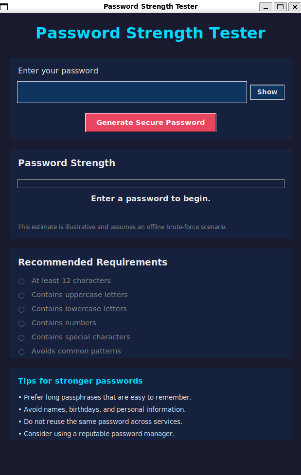

# 🔐 Password Strength Tester

A simple and interactive desktop application to evaluate password strength, built with Python and Tkinter.

This tool provides real-time feedback on password quality, helping users create stronger and more secure passwords.

---

## Features

- Real-time password strength evaluation
- Secure password generation using `secrets`
- Visual strength indicator (progress bar + labels)
- Detection of weak patterns:
  - Sequential characters (`abcd`, `1234`)
  - Repeated characters (`aaaa`, `1111`)
  - Repeated patterns (`abcabc`)
  - Common words and keyboard patterns (`qwerty`, `password`)
- Entropy-based strength estimation
- Estimated resistance to brute-force attacks
- Toggle password visibility

---

## Preview


---

## Project Structure
```
password_strength_tester/
│
├── constants.py
├── main.py
├── ui.py
└── utils.py
```
---
<br>

#### `Created` by ***Andrey Volpini***
